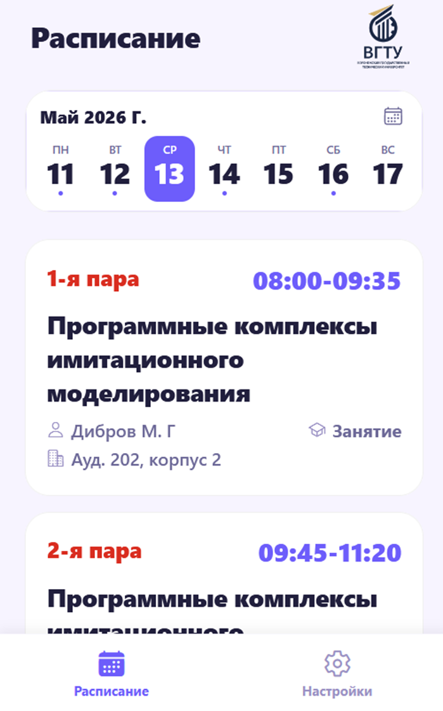
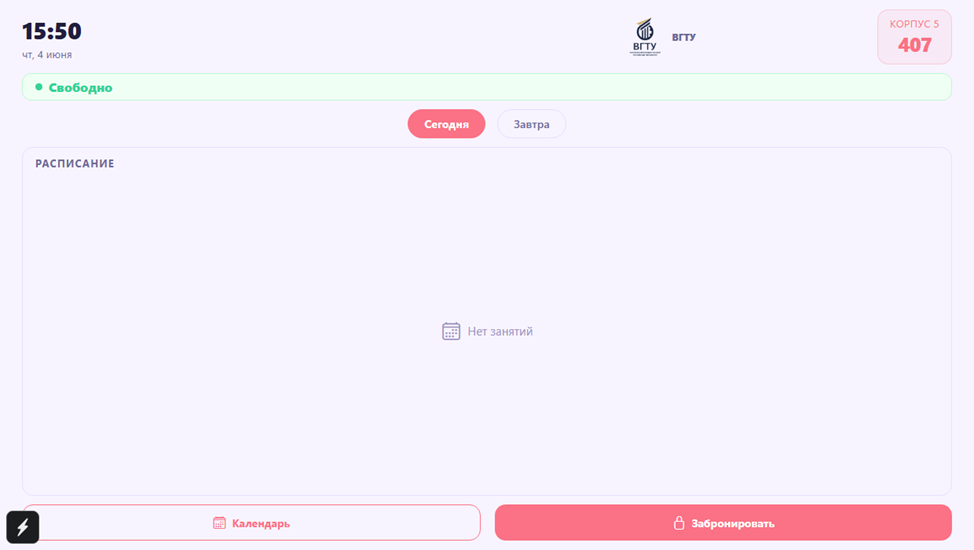
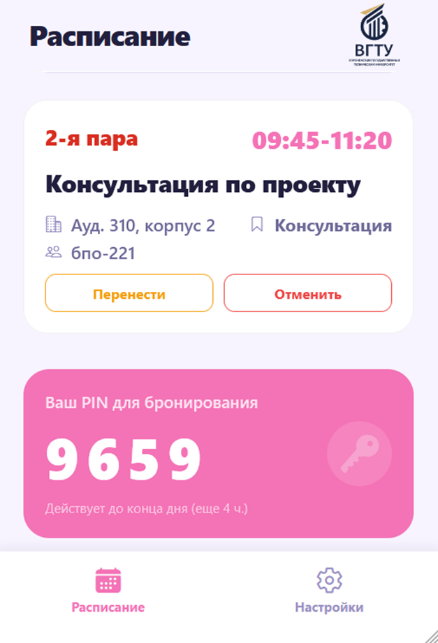
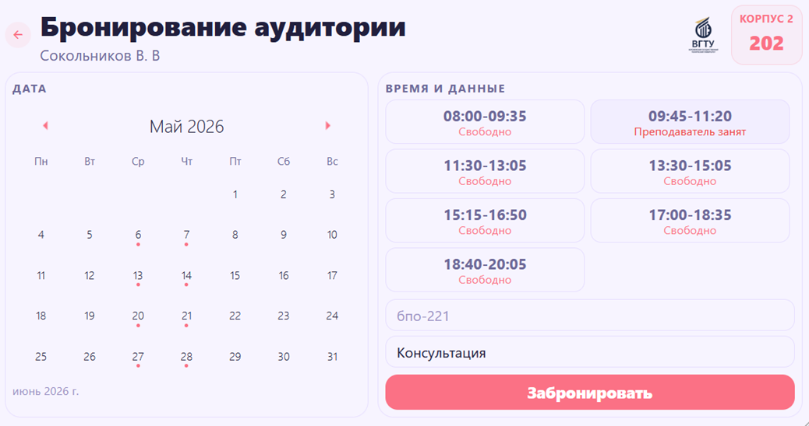
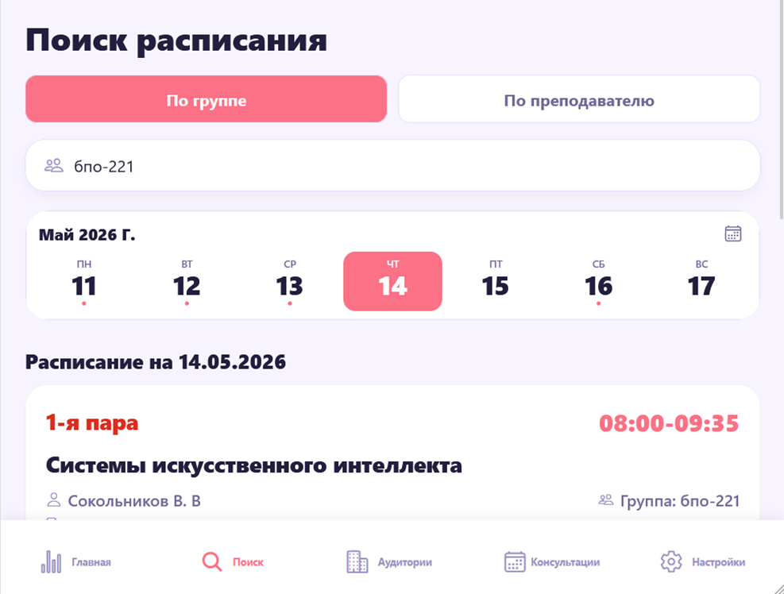
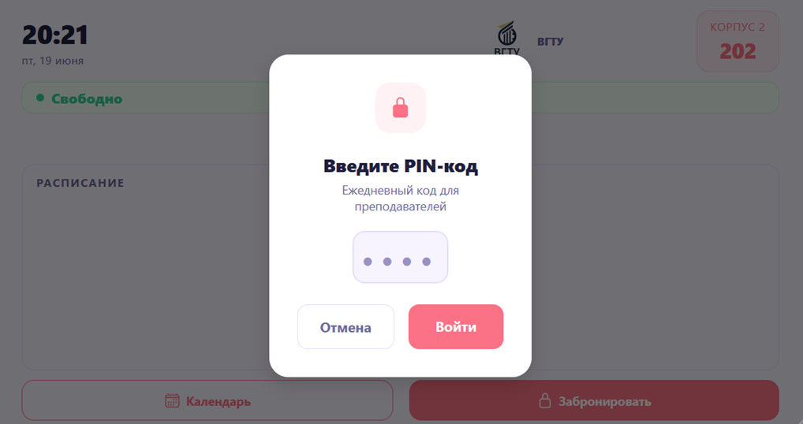
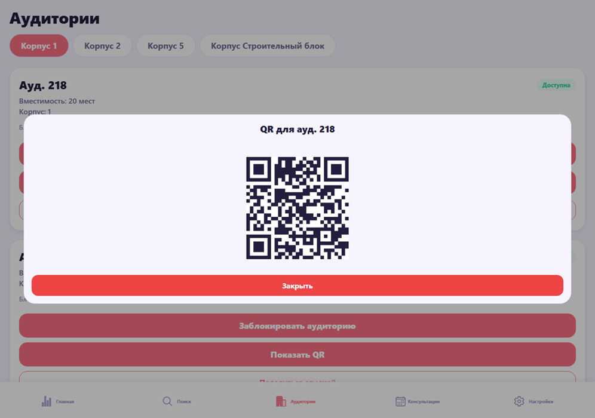

# EduPortal

EduPortal — это мобильное приложение для просмотра учебного расписания и управления аудиторным фондом университета.

Приложение объединяет в себе функциональность просмотра расписания занятий, поиска свободных аудиторий и их бронирования с учетом занятости преподавателей, учебных групп и помещений. Система направлена на упрощение взаимодействия между студентами и преподавателями, а также на повышение эффективности использования аудиторного фонда.

---

## Основные возможности

* Просмотр актуального расписания занятий с возможностью выбора даты и получения подробной информации о занятиях
* Поиск свободных аудиторий с учетом времени, корпуса и текущей занятости
* Бронирование аудиторий преподавателями для проведения консультаций
* Автоматическая проверка конфликтов при создании бронирования (учитываются преподаватель, группа и аудитория)
* Подтверждение бронирования через индивидуальный PIN-код
* Информационное табло аудитории (режим tablet mode) для отображения текущего статуса аудитории
* Импорт расписания из XLSX-файлов с сайта университета
* Обновление данных в реальном времени

---

## Особенности проекта

* Реализована серверная проверка конфликтов, обеспечивающая целостность и актуальность данных
* Используется адаптивный парсер Excel-файлов, способный обрабатывать различные структуры таблиц без жесткой привязки к шаблону
* Поддерживается разделение ролей пользователей (студент, преподаватель, администратор) с различным функционалом
* Реализована настройка информационного табло аудитории через QR-код
* Используется кэширование данных на клиенте для уменьшения количества запросов и повышения скорости работы приложения
* Архитектура приложения позволяет масштабировать систему и интегрировать ее с внутренними сервисами университета

---

## Технологии

* React Native (Expo)
* TypeScript
* Supabase (PostgreSQL)
* React Navigation
* AsyncStorage
* XLSX (парсинг расписания)

---

## Установка и запуск

Запуск на различных платформах:

```bash
npm run android
npm run ios
npx expo start 
npm run web
```

---

## Скриншоты

### Экран расписания (роль студент)



Экран отображает расписание занятий с возможностью выбора даты. Пользователь может просматривать список занятий, получать информацию о преподавателях, аудиториях и времени проведения.

---

### Информационное табло аудитории



Режим отображения для планшетов или экранов, размещенных в аудиториях. Показывает текущее состояние аудитории, ближайшие занятия и расписание на день.

---

### Экран преподавателя (PIN-код)



Каждому преподавателю предоставляется уникальный PIN-код, который используется для подтверждения бронирования аудитории. Код может обновляться для повышения безопасности.

---

### Бронирование аудитории



Интерфейс создания бронирования, позволяющий выбрать дату, временной интервал и аудиторию. Система автоматически отображает доступные варианты и предотвращает конфликты.

---

### Поиск расписания (роль администратор)



Функционал поиска позволяет находить расписание по группе или преподавателю, обеспечивая быстрый доступ к необходимой информации.

---

### Ввод PIN-кода на табло



На информационном табло реализован интерфейс ввода PIN-кода для подтверждения бронирования аудитории непосредственно на месте.

---

### Генерация QR-кода



Функция генерации QR-кода используется для настройки табло аудитории и привязки устройства к конкретному помещению.

---

## Ограничения

На текущем этапе данные расписания загружаются из XLSX-файлов, размещенных на сайте университета. Это требует дополнительной обработки и делает систему зависимой от структуры файлов.

В дальнейшем планируется переход на прямую интеграцию с сервером университета, что позволит повысить надежность и актуальность данных.

---

## Возможности развития

* Интеграция с внутренними системами университета (например, 1С)
* Реализация push-уведомлений о консультациях и изменениях в расписании
* Использование NFC-технологий вместо PIN-кодов для подтверждения бронирования
* Расширение офлайн-режима с возможностью кэширования операций и последующей синхронизации

---

## Статус проекта

Готовое приложение, которое можно внедрять в ход учебного процесса университета